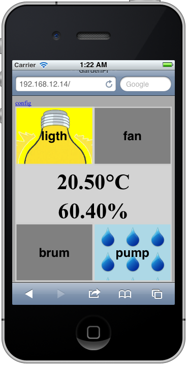
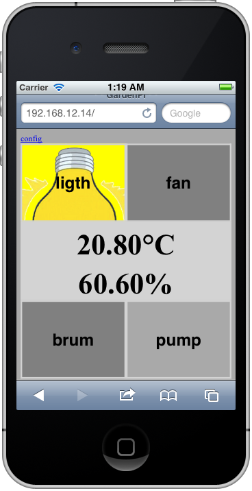

# GardenPi

This is an implementation of webiopi dedicated to indoor growing

* periodic switch on/off of lights, pumps.
* switch of fans based on temperature and humidity measures
* configuration of periodicity for ligths and pumps
* configuration of trigger temperature and humidity values for fans

## setup

* **get a pi ..**
* download and install webiopi [instructions here](http://code.google.com/p/webiopi/wiki/INSTALL)
    * `$ wget http://webiopi.googlecode.com/files/WebIOPi-0.6.0.tar.gz`
    * `$ tar xvzf WebIOPi-0.6.0.tar.gz`
    * `$ cd WebIOPi-0.6.0`
    * `$ sudo ./setup.sh`
* clone this repository
   * `$ git clone https://github.com/yopzolo/GardenPi.git`
* run the install script
   * `$ cd GardenPi`
   * `$ chmod +x install_conf.sh`
   * `$ sudo ./install_conf.sh`
* run webiopi as a daemon
   * `$ cd /etc/init.d`
   * `$ sudo ./webiopi start`

---

## first screenshots

